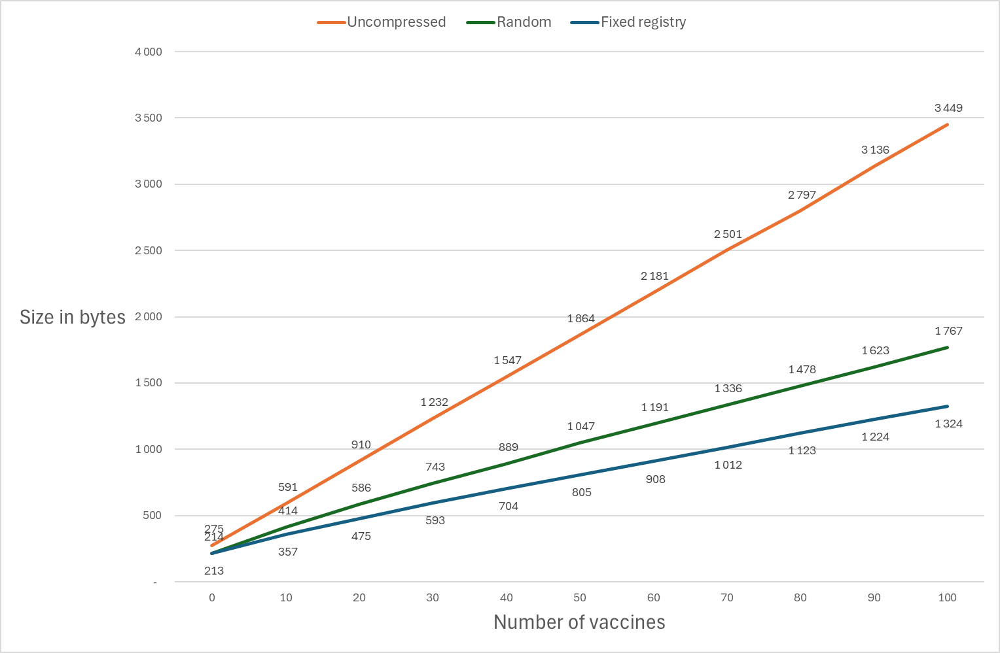

# Compressing

## Size of the COSE object

The overall size of the COSE object depends upon:

-   The length of some strings: key identifier, name and given name, registries names.
-   The numeric values for the ages of administration, vaccine codes, and local indexes

Yet, if we adopt conservative values for these attributes, the overall size of the COSE object is the one sketched in Figure 1 - CLVR global structure:

-   31 bytes for the signature header
-   24 bytes for the CWT header
-   110 bytes for the identity traits
-   31 bytes per vaccine administration
-   66 bytes for the signature value

Thus, an overall size of 541 bytes for 10 recorded vaccines, or 3 331 bytes for 100 recorded vaccines.

It can be significantly reduced by applying the DEFLATE[^8] algorithm, as implemented in the ubiquitous zlib compression library.

[^8]: <https://datatracker.ietf.org/doc/html/rfc1951>

## DEFLATE algorithm

The Deflate algorithm combines two stages of compression:

-   First, with an LZW encoding. It consists in detecting repetitions in the sequence of bytes and replacing a repetition of 3 bytes or more by a backlink to the repeated fragment (repeat X bytes, starting Y bytes backward).
-   Second, with a Huffmann encoding, building an optimal encoding by determining which sequences are the most frequent in the LZW encoded data, then adopting a variable size code for these sequences, the shortest codes being allocated to the most frequent sequences.

It is particularly efficient for CLVR content, that is highly repetitive.

## Deflation results

The result of deflation is not directly predictable. Yet, it can be evaluated through large scale trials on random contents.

The following graph have been established by running 1000 times the creation and compression of CLVR with totally random vaccination events, then with a fixed registry (that corresponds to a person that would have received all his vaccines in a same country) and random administrations. Repeating the experience always give the same results, with only a few bytes of difference and a spread of less than 3% between maximum and minimum value for 60 vaccines or more.

Figure 3 - Impact of deflation

The deflation algorithm run on totally random data reduces by half the size of a CLVR with 100 vaccines, and introducing a minimum of repeatability reduces it again to 38%.

We can then take for granted that any real-life vaccination history would stay way below 1800 bytes.

