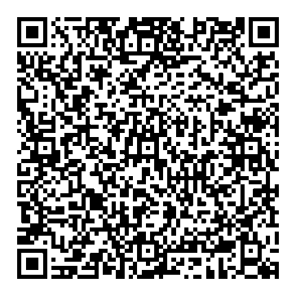

# QR code representation

## [Base45](https://datatracker.ietf.org/doc/rfc9285/) conversion

QR codes are designed to be most efficient when representing homogeneous data. The most common class of data is alphanumeric, with a character set limited to 45 characters.

|    | .0 | .1 | .2 | .3 | .4 | .5 | .6 | .7 | .8 | .9 |
|----|----|----|----|----|----|----|----|----|----|----|
| 0. | 0  | 1  | 2  | 3  | 4  | 5  | 6  | 7  | 8  | 9  |
| 1. | A  | B  | C  | D  | E  | F  | G  | H  | I  | J  |
| 2. | K  | L  | M  | N  | O  | P  | Q  | R  | S  | T  |
| 3. | U  | V  | W  | X  | Y  | Z  |    | \$ | %  | \* |
| 4. | +  | -  | .  | /  | :  |    |    |    |    |    |

(Exemple: letter D is coded as 13)

The compressed COSE object is a binary content. To onboard it into alphanumeric characters, it is converted by replacing 2 bytes (256x256 = 65 536) with 3 characters (45x45x45 = 91 125) in the QR code charset.

The replacement is done by starting with the lowest weight value, while in the original binary content the first byte is the higher weight.

| Coding         | Hexadecimal | Decimal | Base 45             |
|----------------|-------------|---------|---------------------|
| Representation | 41 42       | 16 706  | BB8                 |
| Interpretation | 256\*65+66  | 16 706  | 11+11\*45+8\*45\*45 |

This creates an expansion factor of 1.5, meaning that our maximum 1800 bytes of binary data will be represented with 2700 characters.

## Format prefix

To allow QR code reading tools to identify the content as a vaccination card, the resulting Base45 chain is finally prefixed with a marker “VC1:”, standing for Vaccination Card, version 1. This version 1 only represents the encoding method using COSE, DEFLATE and Base 45; as seen in chapter 4.2 the HCERT content is itself versioned and changes in its structure will not impact the format prefix version.

The final alphanumeric representation of the example data is then:

```
VC1:6BFOXN\*TS0BI\$ZDZRH AENUKSIL3W8 G2RTC RIQJD4\$I1-0OJL395NSR:ZH-O9UVPQRHIY1VS
1NQ1WUXOE9Y431T3\$KOGVV5U+%9SI6%RU/TUPRAAUIWVH\$R1+ZE6%P/T1RM2JOJV 4G.K115WT0PG0Q
B00.I:S9M2JJHHIOI.CBPHNGG2M53%H2W58.0NW58:D9N/IZ.0SBGR:8%HPAQBI1V99S+LF Q8TTEX/H6
LG9Q2.D4DS3UQ5A+I8DV DNH51TSP0FHTU4:9Q:3H6Y7R/JD UH6E:ZBBTN1RERORJ14000K96\$HA
```

## QR code capacity

QR codes are squares, formed by an assembly of square modules. The number of modules defines a [QR Code version](https://www.qrcode.com/en/about/version.html), ranging from Version 1 (21x21 modules) to Version 40 (177x177 modules).

They include redundant information for error correction, with 4 levels of data correction:

-   L: 7% of data can be restored
-   M: 15% of data can be restored
-   Q: 25% of data can be restored
-   H: 30% of data can be restored

Considering that the CLVR document can be read and reprinted whenever needed, a Medium level is appropriate for its encoding.

The table below gives some capacities for storage of alphanumeric content with a medium error correction level.

| Level           | 21   | 24   | 27   | 30   | 33   | 36   | 39   |
|-----------------|------|------|------|------|------|------|------|
| Modules per row | 101  | 113  | 125  | 137  | 149  | 161  | 173  |
| Capacity        | 1035 | 1326 | 1637 | 1994 | 2369 | 2780 | 3220 |

Since a CLVR for 100 vaccines fits within 2700 characters, it means that it can be encoded within a QR Code version 36. This is what will be used for determining the required printing size for the CLVR.

## QR code dimensions

When using a dot-based printer, such as an inkjet printer, the [recommendation from the QR Code designer](https://www.qrcode.com/en/howto/cell.html) is to have at least 4 dots per module, that is 2x2. To secure it further, the calculation is done with a 3x3 module and a low -range printer with a resolution of 300 dots per inch (dpi).

In that case, we have 100 modules per inch, and the 161 modules in a version 36 code will require 1.61 inches, that is 4.1 cm.

The CLVR specification thus requires having it represented as a 5x5 cm square.



