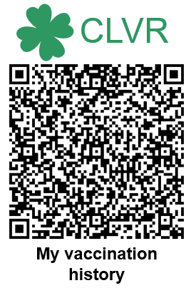

# Layout

To make the CLVR easily recognizable in any document, the QR Code is to be presented with a standardized layout:

-   On top of it, a 5x2cm fixed banner with the clover logo and the CLVR label. The [reference image](media/clover-header.svg) in SVG format can be found in the media folder.
-   Below it, a localized short label for “My vaccination history”

